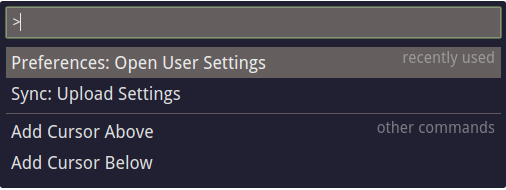

# React Quick-Select Menu

Light-weight quick-select menu with fuzzy search. Inspired by the [vs-code command palette.](https://code.visualstudio.com/docs/getstarted/userinterface#_command-palette)



## Usage

The code below creates the demo you see above.

```javascript
import React, { Component } from 'react';
import ReactDOM from 'react-dom';
import QuickSelectMenu from 'react-qsm';
import './react-qsm.css';

const sections = [
  {
    label: 'recently opened',
    items: [{ label: 'demo.js' }, { label: 'index.html' }]
  },
  {
    prefix: '>',
    label: 'recently used',
    items: [{ label: 'Preferences: Open User Settings' }, { label: 'Sync: Upload Settings' }]
  },
  {
    prefix: '>',
    label: 'other commands',
    items: [{ label: 'Add Cursor Above' }, { label: 'Add Cursor Below' }]
  },
  {
    prefix: '?',
    label: 'help',
    items: [{ label: '... Go to file' }, { label: '# Go to symbol in workspace' }]
  }
];

const onMenuItemSelect = item => console.log(item);

ReactDOM.render(
  <QuickSelectMenu defaultValue=">" onMenuItemSelect={onMenuItemSelect} menuSections={sections} />,
  document.getElementById('root')
);
```

## Installation

`yarn add react-qsm` or `npm install --save react-qsm`

## Props

| Prop             | Type                 | Required | Description                                                                                                       |
| :--------------- | :------------------- | :------: | :---------------------------------------------------------------------------------------------------------------- |
| menuSections     | _array[menuSection]_ | &#x2713; | Array of menuSections. These contain all of the data for the menuItems as well.                                   |
| onMenuItemSelect | _function_           |          | Callback to fire when a menu item is selected. A menuItem will be passed into this callback as the only argument. |
| defaultValue     | _string_             |          | Initial text value of the input. If provided, this would likely be a section prefix.                              |

### menuSection Properties

| Prop   | Type            | Required | Description                                                                                                                                                                                                                                                                                                                         |
| :----- | :-------------- | :------: | :---------------------------------------------------------------------------------------------------------------------------------------------------------------------------------------------------------------------------------------------------------------------------------------------------------------------------------- |
| items  | _array[object]_ | &#x2713; | Array of item objects, which will be passed to `onMenuItemSelect` when selected. The only required property in these objects is `label`, but you can put whatever you want in here (ie `id`).                                                                                                                                       |
| label  | _string_        |          | A label to display for your section.                                                                                                                                                                                                                                                                                                |
| prefix | _string_        |          | A prefix to match at the beginning of the input field in order to display this section. If a prefix for a section is provided, the input box **must** match the prefix to display this section. If a prefix is provided for _any_ section, sections without a prefix will not match when the input box matches the provided prefix. |

## Styling

* There is a minimal and clean stylesheet to get you on your feet quickly located at react-qsm/src/react-qsm.css.
* If you have questions on ways to import a stylesheet, consult the documentation of your build system.

## Future Plans

* Ability to add components to both the left and right side of a menu item. This would allow things like icons to be displayed next to a label.
